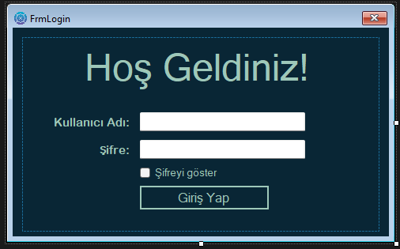
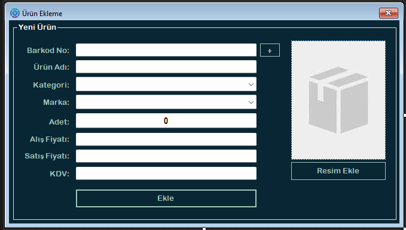
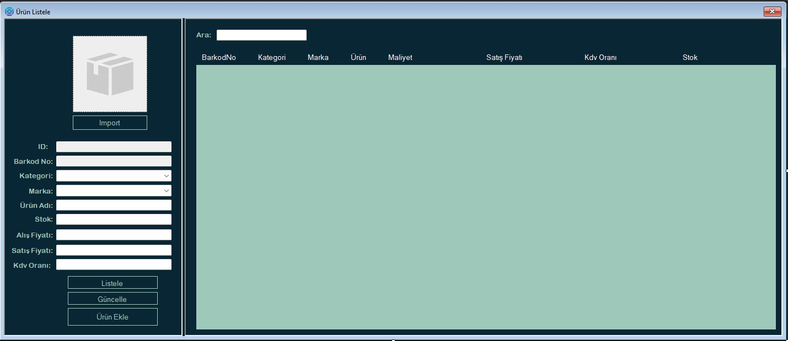
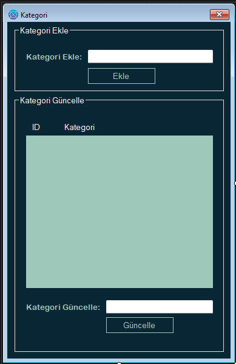
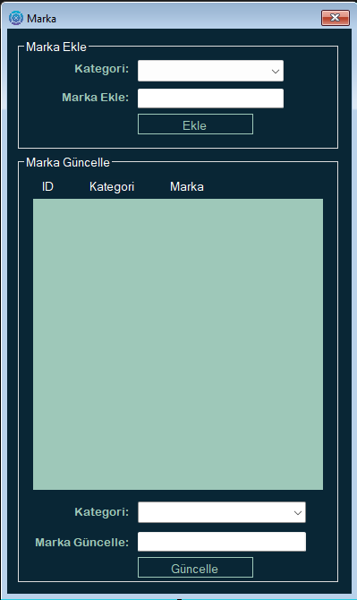
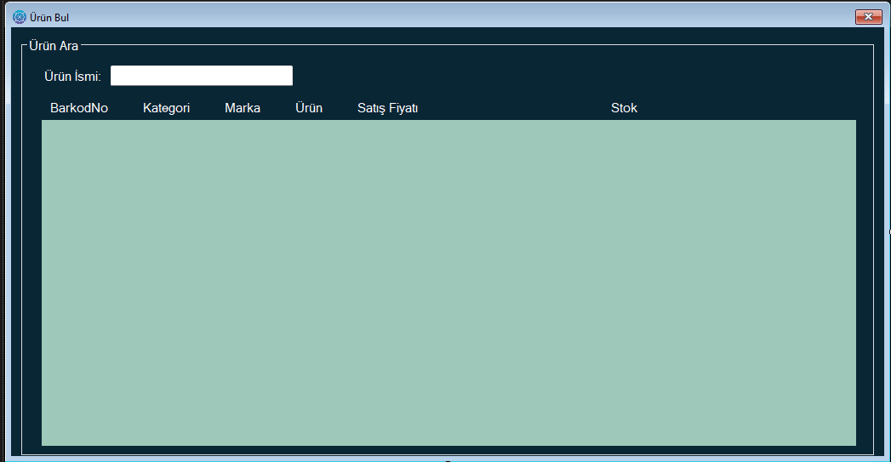
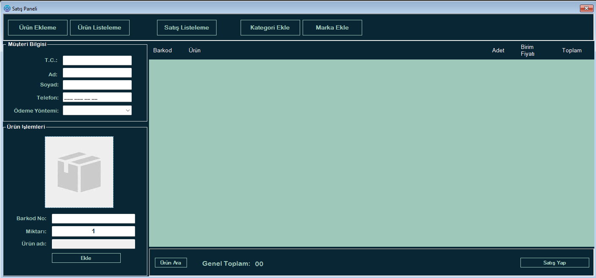
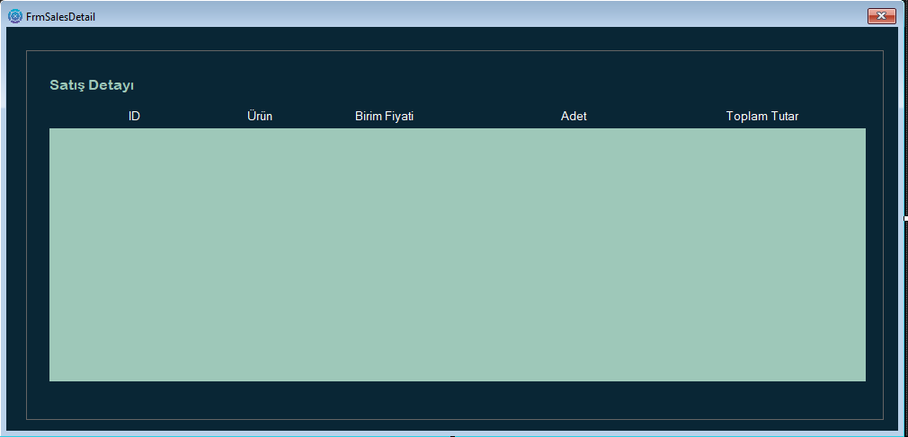
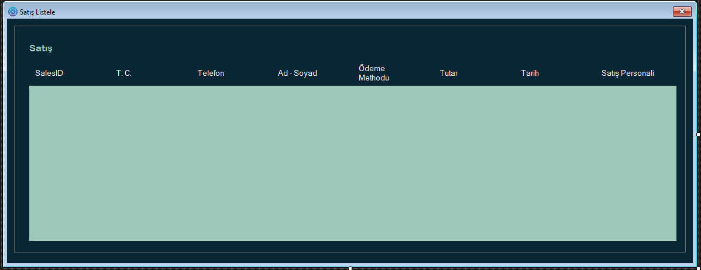

# Stok Takip Programı

Programın çalışır halde bulunan video: www.youtube.com/watch?v=YL2aCuQvhyo
 
# Proje Veritabanının Kurulumu ve Yapılandırılması

Uygulamanın veritabanını kendi SQL Server Management Studio ortamınıza eklemek için aşağıdaki adımları takip ediniz:

1. SQL Server Management Studio'yu açınız.  
2. Sol kısımdaki Databases bölümüne sağ tıklayarak Import Data-tier Application seçeneğine tıklayınız. 
3. Açılan sihirbazda Next butonuna tıklayarak devam ediniz. 
4. Proje klasörüne gidip database klasörünü açınız. 
5. Bu klasörde yer alan stok_takip.bacpac dosyasını seçerek içeri aktarım işlemini tamamlayınız. 
6. Ardından Visual Studio ortamında SqlConnectionCls isimli sınıf dosyasını açınız. 
7. Bu sınıf içerisindeki Constring (bağlantı dizesi) alanını, kendi veritabanınızın bağlantı yoluna göre güncelleyiniz.

Belirtilen adımları eksiksiz uyguladığınız takdirde proje sorunsuz bir şekilde çalışacaktır.

## Giriş Ekranı Sayfası

## Ürün Ekleme Sayfası

## Ürün Kontrollerinin Sağlandığı Sayfa

## Kategori Ekleme Sayfası

## Marka Ekleme Sayfası

## Ürün Arama Sayfası

## Satış Sayfası

## Satış Detayı Sayfası

## Yapılan Satışları Listeleme Sayfası

